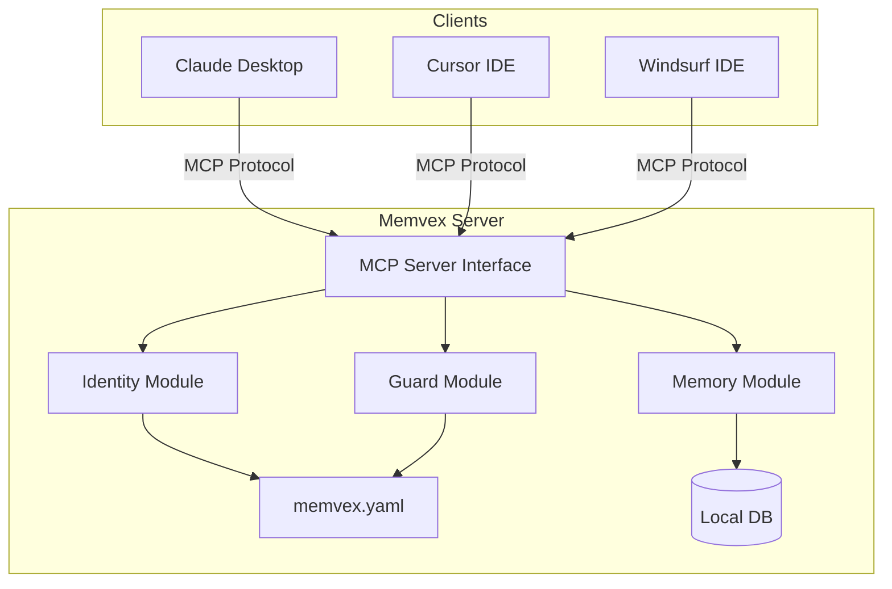

# Memvex

**The Personal Runtime for AI Agents.**

> "Your agents don't know you. Memvex fixes that."


Memvex is an open-source **Model Context Protocol (MCP)** server that gives every AI agent you use access to your **Identity**, **Shared Memory**, and **Action Rules**.

Instead of configuring every agent from scratch, you define yourself *once* in `memvex.yaml`. Any MCP-compatible agent (Claude, Cursor, Windsurf) connects to Memvex to instantly know:

*   **Who you are** (Coding style, communication tone, project context).
*   **What you know** (Shared memory across all your agent interactions).
*   **What is allowed** (Spend limits, approval workflows, forbidden actions).

---

## Why Memvex?

The AI landscape is fragmented. You have **Identity** scattered across `AGENTS.md` and custom prompts. You have **Memory** siloed in individual chat logs. You have **Guardrails** that check for bad words but not bad actions.

Memvex unifies these into a **Personal AI OS Kernel**:

| Feature | The Problem Today | The Memvex Solution |
| :--- | :--- | :--- |
| **Identity** | Copy-pasting "I am a senior dev..." into every prompt. | Define once, query everywhere as `identity_get("coding.style")`. |
| **Memory** | Agent A learns a preference; Agent B has no idea. | Global, persistent memory shared across all agents. |
| **Guard** | Agents can hallucinate commands or delete files. | A central firewall that blocks unauthorized actions. |

---

## Architecture

Memvex is a local-first monorepo that runs as an MCP server on your machine.



*   **`@memvex/core`**: The runtime kernel and config loader.
*   **`@memvex/identity`**: Serves your profile and preferences.
*   **`@memvex/memory`**: Cross-agent memory routing (pluggable backends).
*   **`@memvex/guard`**: Action-level permissioning and approval workflows.
*   **`@memvex/mcp-server`**: Exposes everything as standard MCP tools.
*   **`@memvex/dashboard`**: A local UI to manage your "Self" (Coming Soon).

---

## Getting Started

### Prerequisites
- Node.js v20+
- pnpm

### Installation

```bash
git clone https://github.com/zeroth-agent/memvex.git
cd memvex
pnpm install
pnpm build
```

### Quick Start

1.  **Initialize your config**:
    ```bash
    memvex init
    ```
    This creates a `memvex.yaml` in your current directory.

2.  **Edit your profile**:
    ```yaml
    identity:
      name: "Alex"
      coding:
        style: "functional"
    guard:
      enabled: true
      rules:
        - action: "spend_money"
          max: 50
    ```

3.  **Start the server**:
    ```bash
    memvex serve
    ```

4.  **Connect your agents**:
    See our integration guides for [Claude Desktop](examples/integrations/claude-desktop.md) and [Cursor](examples/integrations/cursor.md).

---

## Roadmap

- [x] **Phase 1: Foundation** (Core, Identity, Basic Memory, Basic Guard)
- [ ] **Phase 2: Deep Memory** (Vector search, episodic memory, graph relations)
- [ ] **Phase 3: Advanced Guard** (Conflict detection, multi-agent arbitration)
- [ ] **Phase 4: Dashboard** (Local UI for managing identity and approvals)
- [ ] **Phase 5: Cloud Sync** (Optional encrypted sync for multi-device users)

See [roadmap.md](roadmap.md) for details.

## Contributing

We welcome contributions! Please see [CONTRIBUTING.md](CONTRIBUTING.md) for details.

## License

MIT © [Zeroth Agent](LICENSE)
