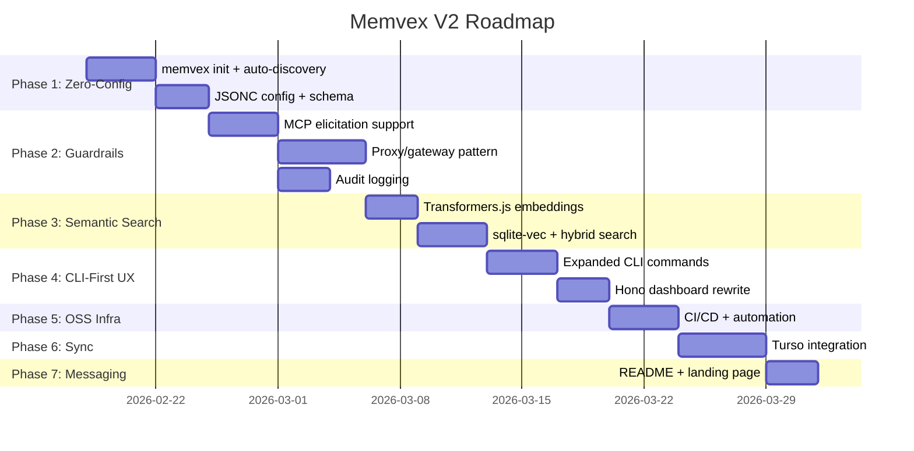

# Memvex V2 Implementation Roadmap

> Phased plan to implement all 10 solutions from the [competitive analysis](./competitive-analysis.md).
> Each phase builds on the previous one. Ship each phase as a usable release before starting the next.

---

## Overview

| Phase | Name | Focus | Effort | Competitive Analysis Solutions |
|-------|------|-------|--------|-------------------------------|
| **1** | Zero-Config Foundation | `npx memvex init`, auto-discovery, JSONC config | 1 week | #2, #9 |
| **2** | Enforceable Guardrails | MCP elicitation, proxy pattern, audit logging | 1-2 weeks | #1, #4 |
| **3** | Semantic Search | Transformers.js embeddings, sqlite-vec | 1 week | #8 |
| **4** | CLI-First UX | Comprehensive CLI, lightweight Hono dashboard | 1 week | #10 |
| **5** | OSS Infrastructure | CI/CD, semantic-release, GitHub automation | 3-4 days | #6 |
| **6** | Cross-Device Sync | Turso/libSQL integration | 1 week | #5 |
| **7** | Positioning & Messaging | README rewrite, landing page, "AI Agent Safety" | 3-4 days | #1, #3, #7 |

**Total estimated effort**: 6-8 weeks

---

## Phase 1: Zero-Config Foundation (Solutions #2, #9)

> **Goal**: `npx memvex init` delivers value in under 2 minutes. No config file required.

### 1.1 — `memvex init` CLI command

Create an interactive init command that auto-detects the user's environment:

```bash
$ npx memvex init
> Welcome to memvex! Scanning your environment...
> ✓ Found name: Basil (from ~/.gitconfig)
> ✓ Found language: TypeScript (from package.json)
> ✓ Found editor: VS Code (from $VISUAL)
> ✓ Found style: 2-space indent (from .editorconfig)
> ✓ Found AI prefs: imported from .cursorrules
> Created 7 seed memories. memvex is ready!
```

**Files to create/modify:**

| File | Action | Description |
|------|--------|-------------|
| `packages/cli/src/commands/init.ts` | NEW | Auto-discovery logic + interactive prompts |
| `packages/core/src/discovery.ts` | NEW | Environment scanner (git, package.json, editor, etc.) |
| `packages/core/src/config-loader.ts` | MODIFY | Support JSONC + zero-config defaults |
| `packages/core/src/types.ts` | MODIFY | Add JSONC config schema types |

**Auto-detection sources (priority order):**

1. `~/.gitconfig` → name, email
2. `$EDITOR` / `$VISUAL` → editor preference
3. `$SHELL` → shell preference
4. `package.json` → language, frameworks, tools
5. `.editorconfig` → indent style, line endings
6. `.cursorrules` / `CLAUDE.md` / `AGENTS.md` → AI preferences
7. `.env` → environment variables (keys only, not values)

### 1.2 — JSONC config with JSON Schema

Replace `memvex.yaml` with optional `memvex.jsonc`:

```jsonc
// memvex.jsonc — only override what you need
{
  "$schema": "https://memvex.dev/schema.json",
  "identity": {
    "name": "Basil",           // auto-detected from git
    "role": "Founder"
  },
  "guardrails": {
    "never": ["rm -rf /", "force push to main"],
    "always": ["run tests before committing"]
  }
}
```

**Progressive disclosure levels:**

| Level | Config | What it does |
|-------|--------|-------------|
| 0 | None | Auto-detected defaults (works out of the box) |
| 1 | Env vars | `MEMVEX_OPENAI_KEY` for optional embeddings API |
| 2 | `memvex.jsonc` | Simple overrides with IDE autocomplete via `$schema` |
| 3 | `memvex.config.ts` | Full TypeScript config with `defineConfig()` |

**Files to create/modify:**

| File | Action | Description |
|------|--------|-------------|
| `packages/core/src/schema.json` | NEW | JSON Schema for `memvex.jsonc` |
| `packages/core/src/config-loader.ts` | MODIFY | JSONC parser, fallback chain: `.ts` → `.jsonc` → `.yaml` → auto-detect |
| `packages/core/src/define-config.ts` | NEW | `defineConfig()` helper for TS config |

### 1.3 — Pre-seed memories on first run

After `memvex init`, automatically create seed memories from discovered context so the tool is never empty.

---

## Phase 2: Enforceable Guardrails (Solutions #1, #4)

> **Goal**: Guardrails that actually block, not just advise. This is the core differentiator from Mem0.

### 2.1 — MCP Elicitation Support

Use MCP's elicitation mechanism to pause tool execution and require human approval:

```typescript
// In guard tool handler
const violation = guardModule.check(action, params);
if (violation.requiresApproval) {
  const result = await server.elicit(
    `⚠️ Guardrail: ${violation.reason}. Override?`,
    { type: "confirmation" }
  );
  if (result.action !== "accept") {
    return { blocked: true, reason: violation.reason };
  }
}
```

**Files to create/modify:**

| File | Action | Description |
|------|--------|-------------|
| `packages/mcp-server/src/server.ts` | MODIFY | Add elicitation calls in guard tool handlers |
| `packages/guard/src/guard.ts` | MODIFY | Return structured violation objects with severity |
| `packages/core/src/types.ts` | MODIFY | Add `GuardViolation` type with severity levels |

### 2.2 — MCP Proxy/Gateway Pattern

Create `memvex-proxy` that wraps any MCP server with guardrails:

```json
{
  "mcpServers": {
    "filesystem": {
      "command": "memvex-proxy",
      "args": ["--rules", "guardrails.jsonc", "--", "npx", "@modelcontextprotocol/server-filesystem"]
    }
  }
}
```

**Files to create:**

| File | Action | Description |
|------|--------|-------------|
| `packages/proxy/` | NEW | Entire new package for MCP proxy |
| `packages/proxy/src/proxy.ts` | NEW | MCP stdio proxy that intercepts tool calls |
| `packages/proxy/src/interceptor.ts` | NEW | Rule evaluation engine for intercepted calls |
| `packages/proxy/bin/memvex-proxy.ts` | NEW | CLI entry point |

### 2.3 — Audit Logging

Log every guardrail evaluation for compliance and debugging:

```typescript
interface AuditEntry {
  timestamp: string;
  action: string;
  agent?: string;
  decision: 'allowed' | 'blocked' | 'approval_required' | 'overridden';
  rule: string;
  params?: Record<string, unknown>;
}
```

**Files to create/modify:**

| File | Action | Description |
|------|--------|-------------|
| `packages/guard/src/audit.ts` | NEW | Audit log backend (SQLite table) |
| `packages/guard/src/guard.ts` | MODIFY | Emit audit entries on every check |

---

## Phase 3: Semantic Search (Solution #8)

> **Goal**: Replace `LIKE` queries with real vector search. Zero API keys. Fully offline.

### 3.1 — Transformers.js Embedding Pipeline

```typescript
import { pipeline } from '@huggingface/transformers';

const extractor = await pipeline('feature-extraction',
  'Xenova/all-MiniLM-L6-v2', { dtype: 'q8' });

async function embed(text: string): Promise<Float32Array> {
  const output = await extractor(text, { pooling: 'mean', normalize: true });
  return new Float32Array(output.data);
}
```

**Model**: `all-MiniLM-L6-v2` — 384 dimensions, ~80MB, 10-50ms/query on CPU.

### 3.2 — sqlite-vec Vector Storage

Add vector search to the existing SQLite database:

```sql
CREATE VIRTUAL TABLE IF NOT EXISTS vec_memories
  USING vec0(embedding float[384]);
```

### 3.3 — Hybrid Search (Text + Vector)

Combine keyword matching with semantic similarity for best results.

**Files to create/modify:**

| File | Action | Description |
|------|--------|-------------|
| `packages/memory/src/embeddings.ts` | NEW | Transformers.js wrapper, lazy model loading |
| `packages/memory/src/vector-store.ts` | NEW | sqlite-vec integration |
| `packages/memory/src/hybrid-search.ts` | NEW | Combined text + vector ranking |
| `packages/memory/src/memory.ts` | MODIFY | Use hybrid search in `recall()` |
| `packages/memory/src/sqljs-store.ts` | MODIFY | Add embedding column to schema |

**Dependencies to add:**

```bash
pnpm add @huggingface/transformers sqlite-vec
```

---

## Phase 4: CLI-First UX (Solution #10)

> **Goal**: Comprehensive CLI that proves the tool's value before any dashboard.

### 4.1 — Expanded CLI Commands

```bash
# Memory
memvex memories list [--namespace ns] [--limit 20]
memvex memories search "what port does our API use?"
memvex memories add "Our API runs on port 3001" --namespace work
memvex memories delete <id>
memvex memories export --format json > backup.json
memvex memories import < backup.json

# Guard
memvex guard rules                    # Show configured guardrails
memvex guard check "deploy to prod"   # Test a rule
memvex guard pending                  # List pending approvals
memvex guard approve <id>
memvex guard deny <id>
memvex guard audit [--last 50]        # View audit log

# Identity
memvex identity show                  # Display current identity
memvex identity set name "Basil"      # Update a field

# System
memvex status                         # All modules status
memvex doctor                         # Diagnose issues
memvex config show                    # Resolved config
memvex config edit                    # Open config in $EDITOR
```

### 4.2 — Lightweight Hono Dashboard (V1.1)

Replace the current React SPA + Express dashboard with a single-file Hono server:

```typescript
import { Hono } from 'hono';
import { serve } from '@hono/node-server';

const app = new Hono();
app.get('/', (c) => c.html(DASHBOARD_HTML));        // Single embedded HTML
app.get('/api/memories', async (c) => c.json(await db.getMemories()));
app.get('/api/guardrails', async (c) => c.json(await db.getGuardrails()));

export const startDashboard = (port = 4983) => serve({ fetch: app.fetch, port });
```

**Target**: ~700 lines total. No build step. No React. No Vite.

**Files to create/modify:**

| File | Action | Description |
|------|--------|-------------|
| `packages/cli/src/commands/memories.ts` | NEW | Full memory CLI |
| `packages/cli/src/commands/guard.ts` | MODIFY | Add `rules`, `audit`, expand commands |
| `packages/cli/src/commands/identity.ts` | NEW | Identity CLI |
| `packages/cli/src/commands/status.ts` | NEW | System status |
| `packages/cli/src/commands/doctor.ts` | NEW | Diagnostic tool |
| `packages/dashboard/` | REWRITE | Replace React SPA with Hono single-file |

---

## Phase 5: OSS Infrastructure (Solution #6)

> **Goal**: Automate everything so a solo maintainer can scale.

### 5.1 — CI/CD Pipeline

| Tool | Purpose |
|------|---------|
| **GitHub Actions** | Build, test, lint on every PR |
| **semantic-release** | Auto-version, changelog, npm publish on merge |
| **Renovate** | Auto-update deps, auto-merge patch versions |
| **actions/stale** | Close stale issues after 30 days |

### 5.2 — Community Infrastructure

| Asset | Purpose |
|-------|---------|
| `CONTRIBUTING.md` | Contribution guidelines, time commitment expectations |
| `.github/ISSUE_TEMPLATE/` | Bug report + feature request templates |
| `.github/PULL_REQUEST_TEMPLATE.md` | PR checklist |
| `SECURITY.md` | Vulnerability reporting process |
| GitHub Discussions | Replace Discord — async, searchable, zero moderation |
| GitHub Sponsors | $5/individual, $25/team, $100/company |

### 5.3 — README Rewrite

Restructure README for the "AI Agent Safety Memory" positioning:

```markdown
# memvex

Memory, identity, and guardrails for AI agents.
Self-hosted. Private. Zero API keys.

## Quick Start (2 minutes)
npx memvex init

## What it does
- 🧠 **Memory** — Persistent, semantic search across all your AI conversations
- 🛡️ **Guard** — Enforceable action boundaries that actually block (not just advise)
- 👤 **Identity** — Auto-discovered preferences injected into every AI interaction
```

**Files to create:**

| File | Action |
|------|--------|
| `.github/workflows/ci.yml` | NEW |
| `.github/workflows/release.yml` | NEW |
| `.github/ISSUE_TEMPLATE/bug.yml` | NEW |
| `.github/ISSUE_TEMPLATE/feature.yml` | NEW |
| `.github/PULL_REQUEST_TEMPLATE.md` | NEW |
| `CONTRIBUTING.md` | NEW |
| `SECURITY.md` | NEW |
| `renovate.json` | NEW |

---

## Phase 6: Cross-Device Sync (Solution #5)

> **Goal**: Memories and guardrails sync across devices via Turso.

### 6.1 — Turso/libSQL Integration

Replace `sql.js` / `better-sqlite3` with `@tursodatabase/sync`:

```typescript
import { connect } from "@tursodatabase/sync";

const db = await connect({
  path: "~/.memvex/memvex.db",           // Local SQLite file
  url: "libsql://memvex-user.turso.io",  // Optional cloud sync
  authToken: process.env.MEMVEX_TURSO_TOKEN,
});

// Sync on demand
await db.push();  // Local → Cloud
await db.pull();  // Cloud → Local
```

**Key benefit**: libSQL has **native vector search**, so sqlite-vec dependency is eliminated.

### 6.2 — Sync CLI Commands

```bash
memvex sync push              # Push local changes to cloud
memvex sync pull              # Pull cloud changes locally
memvex sync status            # Show sync state
memvex sync setup             # Configure Turso credentials
```

**Files to create/modify:**

| File | Action | Description |
|------|--------|-------------|
| `packages/memory/src/turso-store.ts` | NEW | Turso-backed memory store |
| `packages/guard/src/turso-approvals.ts` | NEW | Turso-backed approval queue |
| `packages/cli/src/commands/sync.ts` | NEW | Sync CLI commands |
| `packages/core/src/types.ts` | MODIFY | Add sync config types |

---

## Phase 7: Positioning & Messaging (Solutions #1, #3, #7)

> **Goal**: Reposition memvex as "AI Agent Safety Memory" — the category Mem0 doesn't touch.

### 7.1 — Messaging Framework

| Audience | Message |
|----------|---------|
| **Tagline** | "Memory, identity, and guardrails for AI agents" |
| **Developer** | "The MCP server that gives your AI agents persistent memory, user preferences, and action boundaries — no cloud, no telemetry, no API keys." |
| **Enterprise** | "Designed for environments where data sovereignty matters. Self-hosted by default." |

### 7.2 — Landing Page Refresh

Update the existing landing page with:
- New tagline and positioning
- Interactive demo showing guardrails in action
- Comparison table (memvex vs Mem0 vs NeMo Guardrails)
- "2-minute quickstart" video/GIF

### 7.3 — Archive "Enterprise" Language

Replace any enterprise-targeting copy with:
> "Building for regulated industries? Memvex is designed from the ground up for environments where data sovereignty matters. Self-hosted by default. Apache 2.0 licensed."

---

## Implementation Priority



---

## Success Criteria

| Metric | Target |
|--------|--------|
| Time from `npm install` to "wow" | < 2 minutes |
| Config file required | No (zero-config by default) |
| External API keys required | No (local Transformers.js) |
| Guardrails actually enforce | Yes (MCP elicitation + proxy) |
| Cross-device sync | Yes (Turso, optional) |
| Solo-maintainer sustainable | Yes (full CI/CD automation) |
| Clear Mem0 differentiation | "Memory + Identity + Guardrails" |
